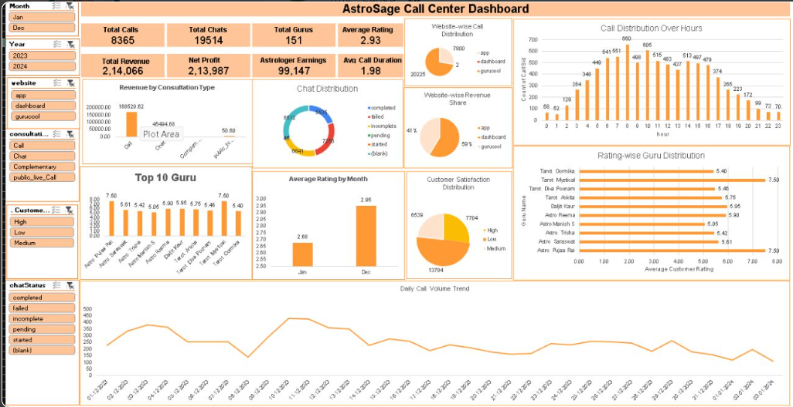

# AstroSage Data Analysis & Dashboard

## Project Overview

This project analyzes AstroSage consultation data using Microsoft Excel and Power Query. The data was cleaned, transformed, and analyzed to generate useful business insights.

## Tools Used

- Microsoft Excel
- Power Query
- Pivot Tables
- Pivot Charts
- Slicers

## Data Cleaning & Preparation

- Cleaned and transformed the consultation dataset
- Created helper columns for Year, Month, Month Number, and Month-Year
- Checked and handled duplicate records
- Prepared the data for analysis and dashboard creation

## Key Analysis

- Total and repeat caller analysis
- Consultation type analysis
- Guru performance analysis
- Date-wise analysis
- Amount and consultation analysis

## Dashboard

Created an interactive Excel dashboard with slicers to analyze the data by:

- Date
- Website
- Consultation Type
- Guru Name

## Project Preview

